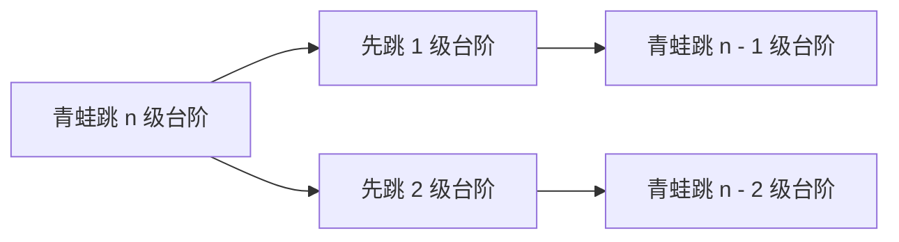
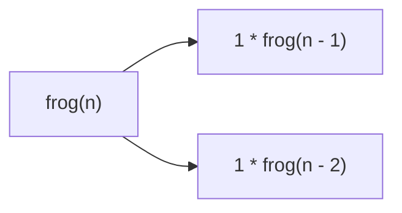

# 递归算法入门

又咕咕好长时间了, 这次有朋友初学py, 被递归难住(尤其是`汉诺塔`问题), 因此写了一篇博客, 简单讲解下递归算法的**算法核心**.

在讲解之前, 要先说明一个最大的误区: 算法是解决问题的方法, 思路, 流程, 不过是体现在代码里, 当然你可以以任何方式体现它, 包括数学.

但注意的是, 算法不是数学的概念, 数学需要算法, 而非算法拘泥于数学.

因此, 很多人理解递归出现问题, 大部分就在这里. 使用数学语言解释是简洁明了的, 但这不代表它和数学有关系, 更不代表它依赖于数学.

[[toc]]

## 1. 数学上的递归算法

### 1.1 阶乘

递归最经典的问题便是阶乘, 但我认为阶乘并不适合递归, 一般人看到阶乘的想法实际上是:

$$
n! = n \times (n-1) \times (n-2) \times ... \times 1
$$

已经被很简单的拆开了, 没有人会愿意找 $n$ 和 $n - 1$ 的关系:

$$
n! = \begin{cases}
& n \times (n - 1)! , & n > 1 \\
& 1 , & n = 0, 1
\end{cases}
$$

所以它并不是一个好例子, 我们直接看`斐波那契数列`

### 1.2 斐波那契数列

`斐波那契数列`是最经典的例子之一, 它的定义是`后一项等于前两项之和`, 即:

$$
fib(n) = fib(n - 1) + fib(n - 2)
$$

我们补充下初始条件, 则为:

$$
fib(n) = \begin{cases}
& fib(n - 1) + fib(n - 2) , & n > 2 \\
& 1 , & n = 1, 2
\end{cases}
$$

转换成代码语言:

::: code-tabs

@tab python
    
```python
def fib(n):
    if n <= 2:
        return 1
    return fib(n - 1) + fib(n - 2)
```

@tab javascript

```javascript
function fib(n) {
	if (n <= 2) return 1
    return fib(n - 1) + fib(n - 2)
}
```

@tab c

```c
int fib(int n) {
    if (n <= 2) return 1;
    return fib(n - 1) + fib(n - 2);
}
```

:::

以上都是老生常谈的内容, 对你的理解没有多余的帮助, 我们开始思考递归的本质.

因为 $n$ 能被拆到 $n - 1$ 和 $n - 2$, 那么 $n - 1$ 就能拆到 $n - 2$ 和 $n - 3$, 接下来的 $n - 4, n - 5, \cdots$

停!

如果你在数学的角度考虑, 那最后会到 $1$, 这是毋庸置疑的. 但是从算法到角度考虑, 我们知道 $n$ 会减小, 这就意味着问题的规模在减小, 此外我们还知道有限规模的问题可以解决, 这才是递归的两个条件:

> 可以分解成更小规模的问题, 且有限规模的问题可以解决.

我们现在要抛弃数学语言了, n都不想要.

### 1.3 青蛙跳台阶

> 共 $n$ 级台阶, 青蛙每次可以跳 $1$ 级或 $2$ 级, 问有多少种跳法?

抛弃数学语言吧, 我们开始分析这个问题为一个函数:


- 如果青蛙先跳 $1$ 级, 那么接下来需要 $n - 1$ 级需要"青蛙跳".
- 如果青蛙先跳 $2$ 级, 那么接下来需要 $n - 2$ 级需要"青蛙跳".

这就是`问题规模的缩小`.

- 如果只有一级台阶, 那么只有一种跳法.
- 如果有两级台阶, 那么有 $(1, 1)$ 和 $(2)$ 两种跳法.

这就是`有限规模的问题可以解决`.

因此, 我们可以写出:



换成程序的语言:



> Q: 先跳 `2` 级台阶, 为什么还是 `1 * frog(n - 2)`, 跳两级不是有 `(1, 1)`, 和 `(2)` 两种跳法吗?
> 
> A: `先跳两级`的 `(1, 1)` 跳法在`先跳一级`中已经被包括了, 不需要重复计算.

写出来发现和斐波那契数一样的.

## 2. 快速排序

上面几个例子都是数学问题, 只是算法在数学上的应用, 尽管第三个问题有个实际的背景, 不是纯粹的数学问题, 但是仍然是个`给你一个数`, `求出一个数`的数学问题, 我们还没用算法来真正"做事".

很多人前两个听懂了理解了, 但是到了`汉诺塔`就懵了, 其实是因为`汉诺塔`不是数学问题, 不要你算东西, 而是要你去"做事", 但学习了12年数学的我们怎么会用数学做事呢.

所以在`汉诺塔`之前, 我插了个`快速排序`的例子, 来体会一下算法是如何做事的(毕竟`汉诺塔`太抽象了, 除了递归之外, 它做的事也挺复杂的).

我们直接看一下快速排序的代码实现(这里展示的是"非原地排序"版本, 比较简单, 但C语言不太好写):

::: code-tabs

@tab python
    
```python
def quick_sort(arr):
    if len(arr) <= 1:
        return arr
    pivot = arr[len(arr) // 2]
    left = [x for x in arr[1:] if x <= pivot]
    middle = [x for x in arr if x == pivot]
    right = [x for x in arr[1:] if x > pivot]
    return quick_sort(left) + middle + quick_sort(right)
```

@tab javascript

```javascript
function quickSort(arr) {
    if (arr.length <= 1) return arr;
    const pivot = arr[arr.length / 2];
    const left = arr.slice(1).filter(x => x <= pivot);
    const middle = arr.filter(x => x === pivot);
    const right = arr.slice(1).filter(x => x > pivot);
    return [...quickSort(left), ...middle, ...quickSort(right)];
}
```
:::

我们用伪代码说说它到底"干了个什么事":

```fake-code
对数组 arr 快速排序 {
    如果 arr 长度为 1 或 0: 直接返回 arr
    
    令 pivot = 数组最中间的数
    数组 left = arr 中所有小于 pivot 的数
    数组 middle = arr 中所有等于 pivot 的数
    数组 right = arr 中所有大于 pivot 的数
    
    返回 对数组 left 快速排序 + 数组 middle + 对数组 right 快速排序
}
```

它是怎么缩小问题规模的:

- 取最中间的数
- 比它小的放左边, 比它大的放右边, 和它相等的放中间, 这样无论左右如何, 中间的数位置都正确了.

$$
\begin{aligned}
25 \ \ 6 \ \ 47 \ \ 3 \ \ 78 \ \ & \underline{19} \ \ 8 \ \ 10 \ \ 33 \ \ 15 \ \ 19 \\
\underset{\text{left}}{\underline{6 \ \ 3 \ \ 8 \ \ 10 \ \ 15}} \ \ & \underset{\text{middle}}{\underline{19 \ \ 19}} \ \ \underset{\text{right}}{\underline{25 \ \ 47 \ \ 78 \ \ 33}} \\
\end{aligned}
$$

- 现在左右两个数组等待排序, 虽然要排序的东西变多了, 但是它们两个必然比原来数组要小


这就是`问题规模的缩小`.

- 当数组长度为 $1$ 或 $0$ 时, 不需要排序.

$$
\underline{6}
$$

这就是`有限规模的问题可以解决`.

理解是怎么分解事件的了吗?

## 3. 汉诺塔问题

背景, 题干什么的不讲了. 我们把三个塔叫做 `L`, `M`, `R`(也有叫`A`, `B`, `C`的, 不过这里还是叫`左`, `中`, `右`吧).

已经知道它是个递归问题了, 那么就从两个条件入手.

- `有限规模的问题可以解决`, 这是废话, 只有一块盘子可以随便移动.
- `问题规模的缩小`, 那么怎么缩小呢?

`问题规模的缩小`意味着`汉诺移动 n 块盘子`可以分解成`汉诺移动 n - 1 块盘子`. 我们不需要去考虑`汉诺移动 n - 1 块盘子`怎么实现的, 我们只知道, 现在有办法`一次性的移动 n - 1 块盘子`了.

既然我们可以`一次性的移动 n - 1 块盘子`, 那么移动 $n$ 块盘子就很简单了:

- 开始.


- 别管怎么移的, 因为在讨论递归, 所以我们先`一次移动 n - 1 个盘子`, 至于这 n - 1 个盘子的细节, 交个 n - 2 的递归去考虑, 现在不用管.


- 最下面一个盘子直接移过去.


- 同样的, 别管怎么移的, 最后再`一次移动 n - 1 个盘子`, 完成问题.


拆解成功! 现在第二个条件也满足了, `移动 n 个盘子`的问题变成`移动 n - 1 个盘子`的问题了, 虽然它被执行了两次, 但规模还是缩小了.

递归的部分已经结束了, 接下来我们要用代码把它展示出来, 这是另一大难点.

请确保递归部分已经没问题了.

代码展示也很难, 导致很多人汉诺塔问题理解不能, 请补药归咎于递归!

对于`汉诺塔`函数, 我们先明确它在干什么.


> Q: 为什么要输入 $3$ 个塔呢, 怎么输入?
> 
> A: 汉诺塔函数可以描述为: "汉诺塔移动法, 移动 n 层, 从`塔1`经`塔2`到`塔3`", 没有`塔2`的辅助是移动不过去的.
> 
> 所以我们把这三个塔分别命名为`起始塔`, `辅助塔`, `目标塔`, 即 `start`, `helper`(也有写作`via`的), `target`.
> 
> 最开始的问题可描述为: 从`左塔`经`中间塔`移动到`右塔`, 即 `start = "L", helper = "M", target = "R"`.

则函数声明如下:

::: code-tabs

@tab python

```python
def hanoi(n, start, helper, target):
    ...

hanoi(4, "L", "M", "R")
```

@tab javascript

```javascript
function hanoi(n, start, helper, target) {
    
}

hanoi(4, "L", "M", "R");
```

@tab c

```c
void hanoi(int n, char start, char helper, char target) {
    
}

int main() {
    hanoi(4, "L", "M", "R");
}
```

:::

接下来实现具体的逻辑, 先看伪代码:

```fake-code
汉诺塔移动 n 层, 从 start 经 helper 到 target {
    如果 n 为 1: 直接把盘子从 start 移动到 target, 结束
    
    汉诺塔移动 n - 1 层, 从 start 经 target 先放到 helper
    把最下面剩下的盘子从 start 移动到 target
    汉诺塔移动 n - 1 层, 再把 helper 的塔 start 移到 target
}
```

注意这里`start`, `helper`, `target`三个变量的传递, 这里是写成函数最容易懵的地方.

> Q: 为什么不写`L`, `M`, `R`了?
> 
> A: 因为参与运算的根本就不是`L`, `M`, `R`.
> 
> 最初是 `L` 经 `M` 到 `R`, 但其中`移动 n - 1 层`时, 是 `L` 经 `R` 到 `M`, 从起始塔到辅助塔, 三个塔的职能变了.
> 
> 也就是说, 函数的运行中, `L`, `M`, `R`三个塔到底谁到谁, 一直都在变, 不变的只有`起始塔`, `辅助塔`, `目标塔`这三个角色的关系.
> 
> 因此我们传递变量, 不传递值.
> 
> 变量是抽象的, 难以理解很正常, 好好想想他们的关系吧. 心里默念`从起始移到目标`, 不是`从左移到右`.

代码如下, 理解了再来抄:

::: code-tabs

@tab python

```python
def hanoi(n, start, helper, target):
    if n == 1:
        print(f"{start} => {target}")
        return
    hanoi(n - 1, start, target, helper)
    print(f"{start} => {target}")
    hanoi(n - 1, helper, start, target)

hanoi(4, "L", "M", "R")
```

@tab javascript

```javascript
function hanoi(n, start, helper, target) {
    if (n === 1) {
        console.log(`${start} => ${target}`);
        return;
    }
    hanoi(n - 1, start, target, helper);
    console.log(`${start} => ${target}`);
    hanoi(n - 1, helper, start, target);
}

hanoi(4, "L", "M", "R");
```

@tab c

```c
void hanoi(int n, char start, char helper, char target) {
    if (n == 1) {
        printf("%c => %c\n", start, target);
        return;
    }
    hanoi(n - 1, start, target, helper);
    printf("%c => %c\n", start, target);
    hanoi(n - 1, helper, start, target);
}

int main() {
    hanoi(4, "L", "M", "R");
}
```

:::

## 4. 扫雷的扩散算法

写一下汉诺塔算法, 写不下来还是没理解, 别往下看.

算法是用来解决问题的, 但是汉诺塔你知道可以用递归来解决, 于是用递归的方式分析, 做出来了.

实际情况是问题为主导, 你不清楚要干什么. 但是用不用递归, 特征很明显.

上面归纳的两条只是递归解决问题时候要考虑到地方, 我们直接举个实际例子.

扫雷中, 当你点开一个空格子(没有数字, 意味着周围都没有雷), 那么它会发生"扩散", 也就是把周围的格子都打开, 如果周围的格子也是空格子, 那么继续扩散.


它有着很明显的递归特征, 尽管你很难用`缩小问题规模`和`有限规模的问题可以解决`来描述它.

它的特征在哪呢? 当翻开格子为空格子时, 这时发生"扩散", 程序的语言讲叫做`执行spread()函数`, 扩散到空格子时, 还会扩散, 意味着`spread()函数`中一定调用了`spread()函数`, 自己调用了自己, 这就是递归.

- `有限规模的问题可以解决`, 只有空格子能扩散, 都是数字就不扩撒了, 同时注意已被翻开的格子也不能扩散.

$$
\begin{aligned}
& \boxed{A} \boxed{B} & \text{当对A执行spread()函数时, 它会对B执行spread()函数} \\
& \boxed{A} \boxed{B} & \text{这是如果不对A做任何标记, B又会对A执行spread()函数} \\
& \boxed{A} \boxed{B} & \text{A再次对B执行spread()函数, 造成死循环, 这是错误做法} \\
& \ & \\
& \boxed{\blacksquare} \boxed{B} & \text{A执行后立即"翻开", B就不会再对A执行spread()函数, 正常扩散下去(或终止)} \\
\end{aligned}
$$

- `问题规模的缩小`, 我们根本不知道问题规模有多大(要扩散多少格子), 但是每次扩散一个格子, 问题规模必然变小了 $1$, 这就够了, 因为问题规模是有限的.

这里展示一部分代码:

::: code-tabs

@tab python
    
```python
def spread(x, y):
    if map[x][y].is_turned():  # 已翻开, 结束
        return
    map[x][y].turn()  # 翻开格子
    if map[x][y].is_number():  # 数字不扩散
        return

    # 这是在二维格子中安全遍历一个格子周围的方法, 这里可以先不去理解
    for dx in [-1, 0, 1]:
        for dy in [-1, 0, 1]:
            if 0 <= x + dx < width and 0 <= y + dy < height:
                if dx == 0 and dy == 0:
                    continue  # 自己不参与运算

                i, j = x + dx, y + dy
                if map[i][j].is_blank():
                    spread(i, j)  # 空格子, 递归扩散
                if map[i][j].is_number():
                    map[i][j].turn()  # 数字, 直接翻开
```

@tab javascript

```javascript
function spread(x, y) {
	if (map[x][y].isTurned()) return; // 已翻开, 结束
    map[x][y].turn(); // 翻开格子
    if (map[x][y].isNumber()) return; // 数字不扩散
    
    // 这是在二维格子中安全遍历一个格子周围的方法, 这里可以先不去理解
    for (const dx of [-1, 0, 1]) {
	    for (const dy of [-1, 0, 1]) {
            if (x + dx >= 0 && x + dx < width && y + dy >= 0 && y + dy < height) {
				if (dx === 0 && dy === 0) continue; // 自己不参与运算
                
                const i = x + dx, j = y + dy;
                if (map[i][j].isBlank()) spread(i, j); // 空格子, 递归扩散
                if (map[i][j].isNumber()) map[i][j].turn(); // 数字, 直接翻开
            }
		}
    }
}
```

:::

~~至于为什么不展示C语言代码, 你看我写的能跑吗~~
