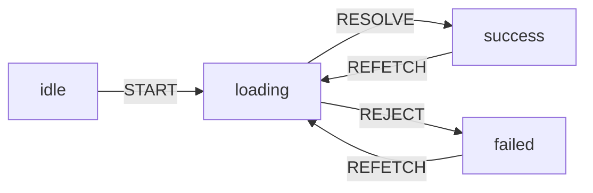
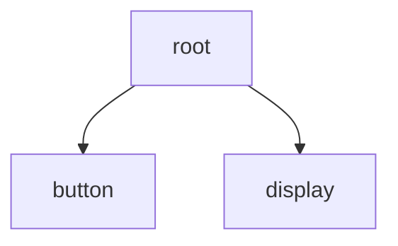
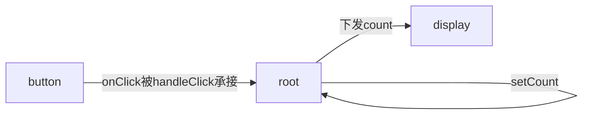

# 从基础到高可用的 React

本文档为 2026 易千前端培训文档, 分享到这里了

[[toc]]

---

React 是一个诞生于 13 年的 web 框架, 也就是在座各位小学甚至幼儿园的时候

React 已经发展到了 React 19, 中间经过十余年的发展, 很多思想现在看来可能显而易见, 确是历史总结下来的最佳实践

React 不单单是组件化, 不单单是一个 ui 框架, 不要拿着 vue 的目光去看待 React, React 背后, 是一整套庞大的状态哲学

<!-- more -->

## 1. 声明式 UI

在 React 之前, 构建 UI 的方式是静态的 HTML, 通过 js 动态的插入 dom, 插入过程非常麻烦

想要把 js 里的数据渲染到页面上, 就必须在代码里构建非常复杂的 dom 结构, 然后插入/替换到页面中

React 提供了在 js 里写 HTML 的方案, 最初通过 `React.render(<div />)` 插入页面, 后来有个直接嵌入代码的 JSX

现代化项目普遍采用 TypeScript 代替 JavaScript, ts 驱动的 JSX 称为 TypeScript JSX, 后缀为 `.tsx`

### 1.1 函数式组件

最初的 React 每个组件是继承组件基类的一个类, 称为类组件, 组件通过 `render()` 暴露 jsx 内容

函数式组件在设计之初就一直存在, 但由于闭包问题, 最初的函数式组件是无状态的, 直到 React 16 引入 hooks, 函数式组件才逐渐取代类组件

函数式组件表现为一个返回 jsx 的函数:

```tsx
function Comp() {
  return (
    <h1>Hello, world</h1>
  )
}
```

函数天然符合组合大于继承的哲学:

```tsx
function Comp1() { return <span>Comp1</span> }
function Comp2() { return <span>Comp2</span> }

function Comp() {
  return (
    <div>
      <Comp1 />
      <Comp2 />
    </div>
  )
}
```

函数天生适合传参:

```tsx
function Comp1({ count }: Readonly<{ count: number }>) {
  return (
    <span>
      Count is
      {count}
    </span>
  )
}

function Comp() {
  return (
    <div>
      <Comp1 count={10} />
    </div>
  )
}
```

### 1.2 JSX 插值

jsx 内使用 `{}` 花括号语法进行插值

```tsx
function Comp() {
  const name = "qnxg"
  return (
    <span>
      Hello
      {name}
      !
    </span>
  )
}
```

不同于 vue, jsx 插值不会自动 `JSON.stringify()`, 因此对对象插值会直接报错, 此处需要严格手动序列化

React 内可以直接插值的类型称为 `ReactNode`, 包括 `ReactChild`, `ReactFragment`, `ReactPortal`, `boolean`, `null`, `undefined`, 其中 ReactChild 包括 `ReactElement`, `string`, `number`, 其中 ReactElement 就是 jsx 元素, 插值要保证符合 jsx 元素或基础类型

```tsx
function InnerComp({
  name,
  children,
}: Readonly<{
  name: string
  children: ReactNode
}>) {
  return (
    <div>
      Hello
      {" "}
      {name}
      !
      {children}
    </div>
  )
}

function OuterComp() {
  return (
    <div>
      <InnerComp name="qnxg">
        {/* children 是一个特殊 props, 相当于 vue 的 slot */}
        <span>I'm children</span>
      </InnerComp>
    </div>
  )
}
```

### 1.3 花括号表达式

React JSX 可直接解析插值的内容, 被称为 js 表达式, 快速判断是否为表达式的方式, 就是直接放到 `return` 后面, 若不会报错, 则认为是表达式

注意表达式的返回类型要为上述模块提到的基础类型或 jsx

基础表达式的插入方法:

```tsx
function Comp() {
  const names = ["Caiwen", "Twisuki"]
  return (
    <div>
      {/* React JSX 内编写 HTML <!----> 注释, 会被当成 HTML 解析, 然后报错 */}
      {/* 因此 jsx 内注释也要用表达式的方式写入, 插值插入注释, 不会被解析 */}
      Hello,
      {" "}
      {names.join(", ")}
      {" "}
      !
    </div>
  )
}
```

对象数组的一般插入方式:

```tsx
interface User {
  name: string
  major: string
}

function Comp() {
  const users: User[] = [
    { name: "Caiwen", major: "rust" },
    { name: "Twisuki", major: "React" },
  ]
  return (
    <div>
      {/* 使用 Array.prototype.map() 构建 jsx 数组并插入 */}
      {users.map(user => (
        {/* React 以树状的格式构造 dom, 同级的动态插入的 dom 需要手动设置唯一 key 来区分内容 */}
        {/* key 要求取唯一值, 优先选择对象的唯一键, 若无, 选择数组 index 即可 */}
        <span key={user.name}>
          Hello {user.name} with {user.major} !
        </span>
      )}
    </div>
  )
}
```

jsx 里可使用 `&&` 开关运算, `??` 或 `||` 兜底运算, `?` 三目运算来实现分支能力:

```tsx
function Comp({
  name,
  loading,
}: Readonly<{
  name: string
  loading: boolean
}>) {
  return (
    <div>
      {loading
        ? <span>加载中...</span>
        : (
            <div>
              <span>Hello</span>
              <span>
                name:
                {name ?? "加载失败"}
              </span>
            </div>
          )}
    </div>
  )
}
```

注意区分 `??` 和 `||` 的不同兜底行为:

```tsx
function Comp({ name }: Readonly<{ name: string | null }>) {
  // ?? 为 undefined 和 null 兜底
  // || 为逻辑假值兜底, 即所有 !!value === false 的值, 包括 undefined, null, false, "", 0 等
  return <span>{(name ?? "加载中") || "用户名为空"}</span>
}
```

复杂分支能力可使用带返回值的函数, 函数返回值满足上述条件即可:

```tsx
function Comp({ users }: Readonly<{ users: User[] }>) {
  return (
    <div>
      {users.map((user, index) => {
        // 对 user 做处理
        // 可进行可读性更好的 if 分支
        if (...) {
          // 可直接 return, 注意返回类型即可
          return <span>if</span>
        }

        // 返回值内可继续 jsx 插值
        return <span>{...}</span>
      })}
    </div>
  )
}
```

## 2. 交互能力

React 为网页带来的交互能力提升不亚于 JavaScript 的诞生

在 React 之前, 希望点击一个按钮, 使 count 增加, 写法是这样的:

```html
<html>
  <body>
    <span id="display"></span>
    <button id="button">Click me!</button>

    <script>
      let count = 0;

      // 手动编写更新元素的方法
      const updateCount = () => {
        const display = document.getElementById("display")
        display.innerHTML = `count is ${count}`
      }

      document.getElementById("button").addEventListener("click", () => {
        count++;

        // 手动触发数据变化后的更新
        updateCount();
      })

      // 手动初始挂载
      updateCount();
    </script>
  </body>
</html>
```

尽管后来有了更方便的 `querySellectAll()` API 和简化操作的库 `jQuery`, 但手动实现一整套生命周期流程依旧非常复杂

因此, React 提出了声明式编程的公式: `UI = f(state)`

### 2.1 UI = f(state)

可交互的 UI 由可变部分和固定部分组成, React 将可变部分抽离出来, 称为 `状态 state`, 而 UI, 就是状态的函数

一个 state 渲染成一个固定的 UI, 所有的变化都由 state 的变化引起, 并自动表现到 UI 上, 开发者只需要在意 UI 上 state 的呈现方式, 无需考虑具体的变化如何应用到 UI 上, 称为 `声明式编程`

```tsx
function Comp() {
  // 定义状态
  const [count, setCount] = useState(0)
  // 操作状态
  const handleClick = () => setCount(count + 1)
  return (
    <div>
      {/* 声明式的描述状态在 UI 上的形式 */}
      <span>
        count is
        {count}
      </span>
      <button onClick={handleClick}>Click me!</button>
    </div>
  )
}
```

### 2.2 状态的派生与副作用

一个来自 vue 文档的例子, 我们在 Excel 表格上, 编辑 `A0: 1, A1: 2, A2: = A0 + A1`, 那么 A0, A1 变化时, A2 会立即同步更新, 但在编程语言中, `let a = 0, b = 1, c = a + b`, 在 a, b 变化时 c 同步变化, 是极其不可理喻的

vue 通过 Proxy 侦听 setter 自动更新内容, 这是极其不符合编程直觉的设计

React 的响应式变量也只是普通的变量, 因此它不存在自动变化的说法, 状态改变发生的变化, 称为 `副作用 effect`

React 处理副作用的方式非常粗暴, 那就是整个组件直接全量重算一遍, 然后比对差异, 更新到页面上

状态可进行如下的派生:

```tsx
function Comp() {
  const [count, setCount] = useState(0)
  const isCountLessThenFive = count < 5
  // ...
  return ...
}
```

可通过 `useEffect` 侦测状态的变化, 称为副作用, useEffect 的签名为 `useEffect(fn, deps)`, 其中 fn 是副作用函数, 即发生变化时执行的函数, deps 是依赖数组, 即承载被侦测内容的数组

```tsx
function Comp() {
  const [count, setCount] = useState(0)
  const [isCountLessThenFive, setIsCountLessThenFive] = useState(true)
  // ...
  useEffect(() => {
    if (count < 5) {
      setIsCountLessThenFive(true)
    }
    else {
      setIsCountLessThenFive(false)
    }
    console.log("count: ", count)
  }, [count])
  return ...
}
```

一般情况下, 派生和副作用都可以用于派生状态, 但我们倾向于使用派生, 更符合声明式编程的哲学, 相比之下副作用是偏命令式的

### 2.3 状态的不可变性与队列更新

useState 导出的状态变量本质上也是个普通变量, 因此它不具备任何响应式, 只有显式的通过导出的 set 函数去修改内容, 才能触发响应式更新和副作用处理

因此为了避免组件内状态的混乱, React 约定, 不允许直接修改响应式变量的值, 保证响应式变量在单个组件生命周期中是不可变的

所以上述按钮和 count 的示例, 实际更新流程为:

1. 初次挂载, useState 导出的 count 为默认值 0, 函数接着向下运行, jsx 拿到值为 0 的 count 并渲染
2. 用户点击按钮, 触发 setCount(count + 1), 此时 count 为 0, 即触发 setCount(1), 触发更新
3. React 调度器重新运行整个函数组件, 先前闭包内 count 为 0 的函数被回收
4. 新的函数组件中, useState 导出的 count 为新设置的 1, 函数接着向下运行, jsx 拿到值为 1 的 count 并渲染

因此, 在任一函数生命周期内, 状态都没发生过改变, 更新的调度是跨函数的

有如下经典问题:

```tsx
function Comp() {
  const [count, setCount] = useState(0)
  const handleClick = () => {
    setCount(count + 1)
    setCount(count + 1)
    setCount(count + 1)
  }
  return ...
}
```

触发 handleClick, 预期情况 count 为 3, 实际情况还是 1, 因为本函数内 count 为 0 不会发生变化, 三次 setCount 都想当与 setCount(1), 函数闭包内状态不更新, 被称为 `闭包陷阱`

解决方案如下, 使用 updater 方式更新状态:

```tsx
function Comp() {
  const [count, setCount] = useState(0)
  const handleClick = () => {
    setCount(prev => prev + 1)
    setCount(prev => prev + 1)
    setCount(prev => prev + 1)
  }
  return ...
}
```

setCount 函数和传入一个 updater 函数, 传入旧值, 拿到新值, 由于 updater 函数是独立的, 有自己的闭包, 故每次都是最新的

来自 React 文档的例子:

```tsx
function Comp() {
  const [count, setCount] = useState(0)
  const handleClick = () => {
    setCount(count + 5)
    setCount(p => p + 1)
    setCount(42)
  }
  return ...
}
```

三次 setCount, 分别相当于, setCount(5), setCount(p => 5 + 1), setCount(42), 最终结果为 42

### 2.4 状态的稳定性

有如下例子:

```tsx
function Comp() {
  const [data, setData] = useState(null)
  const [page, setPage] = useState(1)

  const req = {
    page,
    size: 10,
  }

  const handleNavigateNext = () => setPage(p => p + 1)

  useEffect(() => {
    void request(req).then(res => setData(res.data))
  }, [req])

  return (
    <div>
      <span>
        当前页码:
        {page}
      </span>
      <button onClick={handleNavigateNext}>下一页</button>
      <span>
        data:
        {JSON.stringify(data)}
      </span>
    </div>
  )
}
```

预期初始挂载 page = 1, 请求第一页数据并展示; 之后用户点击翻页, page 更新, req 请求体重新计算, useEffect 侦测到 req 变化, 发送请求, 请求完成触发 setData 把数据呈现到页面上

然后本组件会发生死循环, 当最初请求完成触发 setData 时, 整个函数重新计算, 尽管 pgae 没变, 但 req 作为一个对象, 依旧 `const req = {}`, 相当于新建了一个对象

useEffect 比对 req 是否变化, 使用 `Object.is()` 比对对象引用, 而非实际内容, 因此本次 req 为 `const req = {}` 新建的, React 认为和上次的 req 不是同一个, 就会再次触发副作用函数, 造成死循环

所以把对象作为状态时, 要保证对象内容没变的时候, 对象引用也是不变的, 称为 `引用稳定`

对象的引用稳定可使用 `useMemo` 实现, 签名为 `useMemo(fn, deps)`, fn 为获取返回值的函数, deps 为判断是否需要变化的依赖数组

上述内容可如下改造:

```tsx
function Comp() {
  const [data, setData] = useState(null)
  const [page, setPage] = useState(1)

  // 使用 useMemo 稳定引用
  // 此时仅当 useMemo 的 deps 发生变化, useMemo 的返回值的引用才会发生变化, 否则返回同一个对象
  const req = useMemo(() => ({
    page,
    size: 10,
  }), [page])

  const handleNavigateNext = () => setPage(p => p + 1)

  useEffect(() => {
    void request(req).then(res => setData(res.data))
  }, [req])

  return (
    <div>
      <span>
        当前页码:
        {page}
      </span>
      <button onClick={handleNavigateNext}>下一页</button>
      <span>
        data:
        {JSON.stringify(data)}
      </span>
    </div>
  )
}
```

此时仅当 page 发生变化, req 才会真正发生变化, useEffect 再次依赖 req 就不会出现死循环的问题了, useMemo 本质上是让对复杂对象的变化检测迁移到了对普通变量的变化检测上

上述也可简化实现为:

```tsx
function Comp() {
  const [data, setData] = useState(null)
  const [page, setPage] = useState(1)

  const handleNavigateNext = () => setPage(p => p + 1)

  useEffect(() => {
    const req = {
      page,
      size: 10,
    }
    void request(req).then(res => setData(res.data))
  }, [page])

  return (
    <div>
      <span>
        当前页码:
        {page}
      </span>
      <button onClick={handleNavigateNext}>下一页</button>
      <span>
        data:
        {JSON.stringify(data)}
      </span>
    </div>
  )
}
```

在 useEffect 内部构建 req, 只把实际发生变化的简单变量作为依赖

同样不稳定的还有如下检测函数变化的写法:

```tsx
function Comp() {
  const [data, setData] = useState(null)
  const [page, setPage] = useState(1)

  const handleNavigateNext = () => setPage(p => p + 1)

  const getData = async () => {
    const req = {
      page,
      size: 10,
    }
    const res = await request(req)
    setData(res.data)
  }

  useEffect(() => {
    void getData()
  }, [getData])

  return (
    <div>
      <span>
        当前页码:
        {page}
      </span>
      <button onClick={handleNavigateNext}>下一页</button>
      <span>
        data:
        {JSON.stringify(data)}
      </span>
    </div>
  )
}
```

page 变化, getData 函数内容发生变化, useEffect 侦测到变化并触发请求, 但这个函数也是不稳定的, 函数的引用稳定可使用 `useCallback`

```tsx
function Comp() {
  const [data, setData] = useState(null)
  const [page, setPage] = useState(1)

  const handleNavigateNext = () => setPage(p => p + 1)

  // 使用 useCallback 稳定引用
  // 此处作用等同于 useMemo, 只不过作用对象为一个函数
  const getData = useCallback(async () => {
    const req = {
      page,
      size: 10,
    }
    const res = await request(req)
    setData(res.data)
  }, [page])

  useEffect(() => {
    void getData()
  }, [getData])

  return (
    <div>
      <span>
        当前页码:
        {page}
      </span>
      <button onClick={handleNavigateNext}>下一页</button>
      <span>
        data:
        {JSON.stringify(data)}
      </span>
    </div>
  )
}
```

## 3. 状态管理

React 声明式 UI 解决了复杂交互无法手动控制的问题, 但随着交互的进一步复杂化, 状态也会越来越复杂

因此 React 社区发展出了一整套状态管理的哲学

### 3.1 组件纯粹性与受控能力

对于如下组件:

```tsx
function Comp() {
  return (
    <input placeholder="请输入..." />
  )
}
```

本组件没有状态变量, 根据 `UI = f(state)`, 应该只有一种固定的 UI 样式, 然而, 输入框本身可以承载我们的输入内容, 当我们输入时, 输入框内容变化, 并展示到页面中, 但它没对应任何一个状态变量, 我们认为这个组件是不纯粹的, 是违背 `UI = f(state)` 的, 原因是 `<input />` 这类原生输入组件, 有能力自己维护一个状态不外泄

为了让组件纯粹, 有如下写法:

```tsx
function Comp() {
  const [value, setValue] = useState("")
  return (
    <input
      value={value}
      onChange={e => setValue(e.target.value)}
    />
  )
}
```

此处定义了 value 的状态变量, 并要求 input 展示内容必须是 value 变量, input 输入事件直接修改 value 变量, 现在 input 不再有任何内部状态, UI 严格由本组件的 value 变量控制, 称为 `受控`

很多组件库都天然支持受控和非受控两种写法, 受控可严格控制展示内容, 方便做数据校验等, 非受控则方便编写, 不必为了管理 UI 多写一个模板状态

### 3.2 状态机模型

对于少数几种状态, 散落在不同的状态变量中还可以接受, 但如果一个事件状态庞大, 转换关系复杂, 条件分支错乱, 这时散落在几个状态变量里将变得非常难以管理

如一个请求有可写成如下的形式:

```tsx
function Comp() {
  const [data, setData] = useState(null)
  const [error, setError] = useState(null)
  const [isLoading, setIsLoading] = useState(false)

  const isSuccess = !isLoading && !!data
  const isFailed = !isLoading && !!error
  const isSattled = !isLoading

  const refetch = () => {
    if (isLoading)
      return

    setIsLoading(true)
    void request()
      .then(res => setData(res.data))
      .catch(err => setError(err))
      .finally(() => setIsLoading(false))
  }

  useEffect(() => refetch(), [])
}
```

上述描绘了一个请求的基本格式, 由三个基础状态变量决定所有内容, 但业务上是否有可能, 存在一种情况, data 或 error 被错误更新, 导致 data 和 error 都有值的情况, 此时派生状态拿到的信息是 `既成功又失败`, 造成业务 panic

因此对于这个请求业务, 可构建如下的模型:



图中将本业务可能发生的所有动作和状态全部绘出, 并绘制了转化关系, 该模型称为 `状态机模型`, 状态机每个节点称为 `状态 state`, 包含 `状态名 status` 和其他状态变量, 每个转化关系称为 `操作 action`, 操作可携带 `负载 payload`
i
当整个状态机位于某个状态, 只能通过特定的 action, 更新到另一个状态, 并更新对应负载, 不得出现状态机未定义的操作

可手动实现上述状态机:

```tsx
type Status = "idle" | "loading" | "success" | "failed"
interface State {
  status: Status
  data: Data | null
  error: Error | null
}
type Action
  = | { type: "START" }
    | { type: "RESOLVE", payload: Data }
    | { type: "REJECT", payload: Error }
    | { type: "REFETCH" }

function Comp() {
  const [state, setState] = useState<State>({
    status: "idle",
    data: null,
    error: null,
  })

  const dispatch = (action: Action) => {
    switch (action.type) {
      case "START":
        setState({
          status: "loading",
          data: null,
          error: null,
        })
        break
      case "RESOLVE":
        setState({
          status: "success",
          data: action.payload,
          error: null,
        })
        break
      case "REJECT":
        setState({
          status: "failed",
          data: null,
          error: action.payload,
        })
        break
      case "REFETCH":
        setState({
          status: "loading",
          data: null,
          error: null,
        })
        break
    }
  }

  const fetch = () => {
    void request()
      .then(res => dispatch({ type: "RESOLVE", payload: res.data }))
      .catch(err => dispatch({ type: "REJECT", payload: err }))
  }

  const refetch = () => {
    dispatch({ type: "REFETCH" })
    fetch()
  }

  useEffect(() => {
    dispatch({ type: "START" })
    fetch()
  }, [])
}
```

对于上述内容, React 提供了 `useReducer` API, 拥有更严格的状态机实现约定:

```tsx
type Status = "idle" | "loading" | "success" | "failed"
interface State {
  status: Status
  data: Data | null
  error: Error | null
}
type Action
  = | { type: "START" }
    | { type: "RESOLVE", payload: Data }
    | { type: "REJECT", payload: Error }
    | { type: "REFETCH" }

// 独立的转换关系函数
function reducer(state: State, action: Action) {
  switch (action.type) {
    case "START":
    case "REFETCH":
      return { status: "loading", data: null, error: null }
    case "RESOLVE":
      return { status: "success", data: action.payload, error: null }
    case "REJECT":
      return { status: "failed", data: null, error: action.payload }
    default:
      return state
  }
}

function Comp() {
  // 使用 useReducer, 传入转换关系函数和初始状态, 拿到当前状态和触发函数
  const [state, dispatch] = useReducer(reducer, {
    status: "idle",
    data: null,
    error: null,
  })

  const fetch = () => {
    void request()
      .then(res => dispatch({ type: "RESOLVE", payload: res.data }))
      .catch(err => dispatch({ type: "REJECT", payload: err }))
  }

  const refetch = () => {
    dispatch({ type: "REFETCH" })
    fetch()
  }

  useEffect(() => {
    dispatch({ type: "START" })
    fetch()
  }, [])
}
```

> 作业 1: 为如下热水器组件接入状态机
>
> 说明:
>
> 1. 初始水温 `ENV_TEMP`, 最小时间单位 `tick` 为 1000ms
> 2. 关机或保温模式, 水温每 tick 下降 2, 直到达到 `ENV_TEMP`
> 3. 加热模式水温每 tick 增加 5
> 4. 加热至水温达到 target 进入保温模式, 保温默认水温下降到 target 回到加热模式
> 5. 传入参数的 target 为设置水温, active 为开关机
>
> ```tsx
> const ENV_TEMP = 20
>
> type Status = "off" | "heating" | "keeping"
> interface State {
>   status: Status
>   current: number // 当前水温
>   target: number // 目标水温
> }
> type Action
>   = | { type: "SET", payload: { target: number } } // 设置温度
>     | { type: "START" } // 开机
>     | { type: "TICK", payload: { next: number } } // 时间流逝(水温变化)
>     | { type: "END" } // 关机
>
> function reducer(state: State, action: Action) {
>   // ...
> }
>
> function Heater({
>   target,
>   active,
> }: Readonly<{
>   target: number
>   active: boolean
> }>) {
>   const [state, dispatch] = useReducer(reducer, {
>     status: "off",
>     current: ENV_TEMP,
>     target: 100,
>   })
>
>   // ...
>   return (
>     <div>
>       <span>状态(关闭/加热/保温):</span>
>       <span>水温:</span>
>     </div>
>   )
> }
>```

### 3.3 跨组件状态传递与单向数据流

有如下 DOM 树:



依旧是 `const [count, setCount] = useState(0)` 和 `handleClick = () => setCount(p => p + 1)`, display 消费 count 状态, button 触发 set 操作, 如何组织状态变量的定义位置

由于 button, display 均消费该 state, 因此该状态提升到公共的父组件 root 中:

```tsx
function Button({ onClick }: Readonly<{ onClick: () => {} }>) {
  return <button onClick={onClick}>Click me!</button>
}

function Display({ count }: Readonly<{ count: number }>) {
  return (
    <span>
      count is
      {count}
    </span>
  )
}

function Root() {
  const [count, setCount] = useState(0)
  const handleClick = () => setCount(p => p + 1)
  return (
    <div>
      <Button onClick={handleClick} />
      <Display count={count} />
    </div>
  )
}
```

事件的派发方式是:



React 中, 数据只能从上到下的传递, 称为 `单向数据流`

而必要的从下往上回复传递数据的过程, 则使用事件模型, 子组件暴露事件, 父组件处理事件, 本质上状态本身的修改完全发生在父组件内, 不违背单向数据流的哲学

### 3.4 范围内状态共享

若一个庞大的组件树都要共享同一个状态变量, 按照单向数据流的哲学, 需要把状态定义到最外层公共组件上, 然后通过 props 逐级传递 state, 每一级组件都要留有 state 和 onChange props, 并处理下一级的 handleChange, 暴露给上一级, 非常麻烦

因此 React 提供了 `上下文 context` 的概念, 可在一定范围内共享状态

通过 `createContext` 创建上下文:

```tsx
const CountContext = createContext(null)
```

为上下文准备 Provider:

```tsx
function CountProvider({ children }: Readonly<{ children: ReactNode }) {
  // 在 Provider 中定义状态
  const [count, setCount] = useState(0)
  const value = useMemo(() => ({
    count,
    setCount,
  }), [count, setCount])
  return (
    {/* React 18 及更早版本(微生活新前端为 React 18)需要使用 CountContext.Provider */}
    <CountContext value={value}>
      {children}
    </CountContext>
  )
}
```

状态变量本质上挂载在 Provider 中, 通过 context 来分发给内部每一个组件

消费 context 状态变量:

```tsx
function Comp() {
  // React 18 及更早版本需要使用 useContext
  const { count, setCount } = use(CountContext)
  // ...
}
```

若使用 useContext 消费一个 context, 但该组件未在该 context 的 Provider 内部, 则拿到的值为 undefined

一般封装一个 hook 统一使用 context, 并对上述行为直接报错:

```tsx
function useCountContext() {
  const context = use(CountContext)
  if (!context) {
    throw new Error("useCountContext must be used within a CountProvider")
  }
  return context
}
```

注意: context 变量本质上挂载在 Provider 上, 因此 set 时, 整个 Provider 及下面的组件树都会更新, 可能有性能问题, 设计 context 时, 尽可能保证 context 职责单一, 保证每次全量更新都是必要的

> 作业 2: 编写 theme 控制体系
>
> 说明:
>
> 1. theme 需要跨组件共享, 所有组件都需要响应
> 2. 设置 theme 拥有 light, dark 和 auto 三种模式
> 3. thmem 本身有 light 和 dark 两种状态
> 4. 相关 context, hook 类型已定义, 按照给定类型完成任务
>
> ```tsx
> type Theme = "light" | "dark"
> type Mode = "light" | "dark" | "auto"
> interface ThemeContextValue {
>   theme: Theme
>   mode: Mode
>   setTheme: (theme: Theme) => void
>   setMode: (mode: Mode) => void
> }
>
> interface ThemeResult {
>   theme: Theme
>   mode: Mode
>   isDark: boolean
>   isLight: boolean
>   isAuto: boolean
>   toggleTheme: () => void
>   setTheme: (theme: Theme) => void
>   setMode: (theme: Theme) => void
> }
>
> const ThemeContext = createContext<ThemeContextValue>(null)
>
> function ThemeProvider({ children }: Readonly<{ children: ReactNode }>) {
>   // ...
>   return (
>     <ThemeContext value={...}>
>       {children}
>     </ThemeContext>
>   )
> }
>
> function useTheme(): ThemeResult {
>   const context = use(ThemeContext)
>   if (!context) {
>     throw new Error("useTheme must be used within a ThemeProvider")
>   }
>
>   const { theme, mode, setTheme, setMode } = context
>
>   // ...
>
>   const getWindowTheme = (): Theme => {
>     if (typeof window === "undefined")
>       return "light"
>     return window.matchMedia("(prefers-color-scheme: dark)").matches ? "dark" : "light"
>   }
>
>   // ...
> }
> ```

### 3.5 可变的记忆状态

React 里几乎所有状态相关的内容, 在跨函数的更新中, 都是全新的

状态变量每次从 useState 里面拿到上次 set 的新值, 派生状态完全重新计算, useMemo 等仅能在不变时保持稳定, 大部分情况依旧是全新的内容, 这是 React 不可变设计的结果

但 React 依旧留下了一个引用永久稳定, 可直接变化, 用于跨函数记忆状态的 api `useRef`

此处的 `useRef` 和 vue 的 `ref` 没有任何关系, 它的签名是 `useRef<T>(init: T): { current: T }`, 即:

```tsx
const ref = useRef(0)
console.log(ref) // { current: 0 }
```

`ref.current` 可无视不可变设计的规则, 允许直接编辑, 如:

```tsx
function Comp() {
  const countRef = useRef(0)
  const handleClick = () => {
    countRef.current++
    console.log("count: ", countRef.current)
  }
  return <button onClick={handleClick}>Click me!</button>
}
```

`ref.current` 被修改不会触发副作用更新, 只能用于记住当前值

如下停表组件:

```tsx
function Stopwatch() {
  const [start, setStart] = useState(null)
  const [now, setNow] = useState(null)
  const ref = useRef(null)

  const handleStart = () => {
    setStart(Date.now())
    setNow(Date.now())
    clearInterval(ref.current)
    ref.current = setInterval(() => {
      setNow(Date.now())
    }, 100)
  }

  const handleStop = () => {
    clearInterval(ref.current)
  }
}
```

### 3.6 生命周期

在类组件时代, React 组件有明确的生命周期, `componentDidMount`, `ComponentDidIpdate`, `ComponentWillUnmount`, 与 vue 非常类似

当在当前 hooks 时代, 所有的生命周期均使用副作用模型实现

空依赖的 useEffect 在挂载后执行:

```tsx
function Comp() {
  useEffect(() => {
    console.log("mounted")
  }, [])
}
```

useEffect 的副作用函数可返回一个函数, 称为清理函数, 该函数将在组件卸载时执行:

```tsx
function Comp() {
  useEffect(() => {
    console.log("mounted")
    return () => {
      console.log("unmounted")
    }
  }, [])
}
```

配合使用一般用于构建计时器:

```tsx
function Comp() {
  useEffect(() => {
    const timer = setInterval(() => {
      console.log("tick")
    }, 1000)

    return () => {
      clearInterval(timer)
    }
  }, [])
}
```

组件更新时, useEffect 侦测状态的变化, 会先执行上一次的清理函数(若存在), 然后执行新的副作用函数

```tsx
function Comp() {
  const [data, setData] = useState(null)
  const [page, setPage] = useState(0)

  useEffect(() => {
    // 轮询
    const timer = setInterval(() => {
      void request(page).then(res => setData(res.data))
    }, 1000)

    return () => {
      // page 变化清理上一次轮询
      clearInterval(timer)
    }
  }, [page])
}
```

useEffect 执行发生在浏览器绘制阶段之后, 此时页面已绘制完成, 若 useEffect 内操作了 dom (直接操作, 而非通过 state 操作), 页面会闪烁, 因此 React 提供了 useLayoutEffect API, 用法和 useEffect 一致, 但它发生在 dom 更新之后, 浏览器绘制之前, 并同步操作, 会阻断浏览器绘制, 此时直接操作页面不会闪烁
